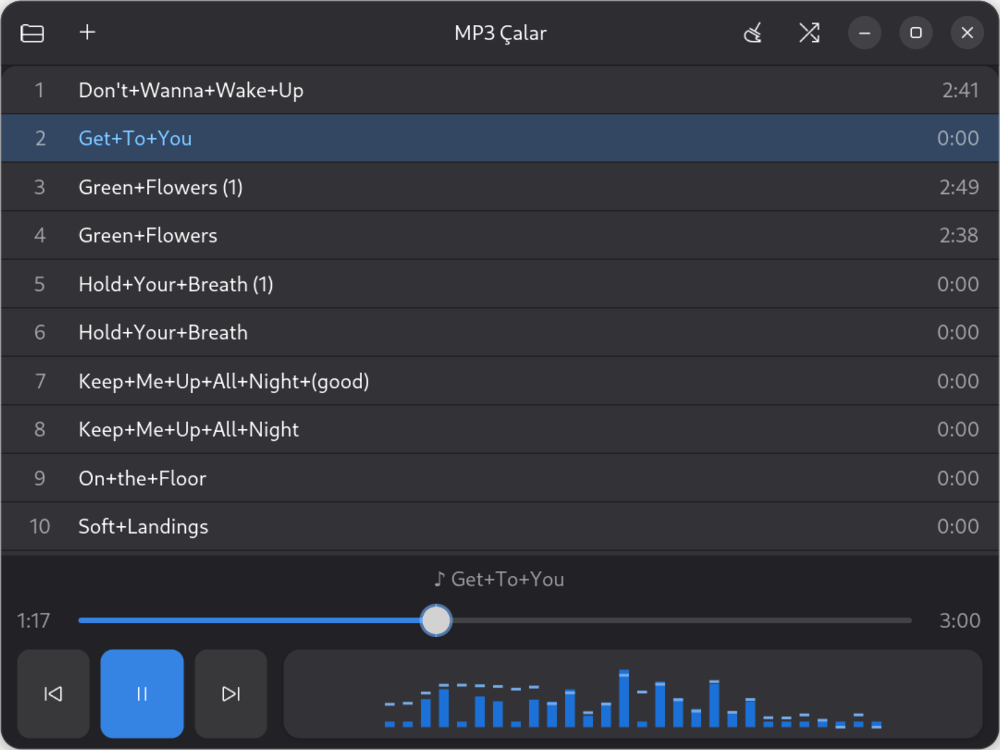

<p align="center">
  
</p>

<p align="center">
  
</p>

<h1 align="center">MP3 Player</h1>

<p align="center">
  A minimal, modern MP3 player for Debian 13 + GNOME.<br>
  No clutter — just your music and a live spectrum.
</p>

---

## English

A simple and modern MP3 player built with the tools already on your system:
GTK4 + Libadwaita + GStreamer. No extra packages needed.

### Features

- **Playlist** — drag & drop a folder onto the window and every MP3 inside is added (single MP3 files work too)
- **Double-click** a track to play it
- Tracks continue **in order** automatically, or hit **shuffle** for random playback
- Previous / Play-Pause / Next buttons on the left and a seek bar (volume is controlled from the system)
- Real-time spectrum analyzer under the seek bar: 28 log-spaced bars (30 Hz–16 kHz) sampled up to 60×/s from the actual audio, with peak-hold caps and latency compensation so the bars stay in sync with the sound
- Remove the selected track with the Delete key, clear the whole list with one click
- Playlist is saved automatically (`~/.config/mp3-player/playlist.json`)

### Run

```sh
./run.sh
# or
python3 main.py
```

Requirements (pre-installed on Debian 13): `python3-gi`,
`gir1.2-gtk-4.0`, `gir1.2-adw-1`, `gir1.2-gstreamer-1.0`,
`gstreamer1.0-plugins-good`, `gstreamer1.0-plugins-bad`,
`gstreamer1.0-plugins-ugly`, `python3-mutagen`.

### Add to the GNOME menu (recommended)

```sh
./install.sh
```

This adds "MP3 Çalar" to the applications menu, installs the logo as its
icon, and puts the `mp3-player` command under `~/.local/bin`.
Run `uninstall.sh` to remove everything.

### Usage

1. Drag your music folder onto the window.
2. Double-click the track you want to hear.
3. Tracks play in order; enable the shuffle button on top for random playback.

### Tests

```sh
python3 -m unittest discover -s tests -v
```

---

## Türkçe

Sistemde zaten kurulu araçlarla yazılmış sade ve modern bir MP3 çalar:
GTK4 + Libadwaita + GStreamer. Ekstra paket gerekmez.

### Özellikler

- **Playlist** — klasörü pencereye **sürükle-bırak**, içindeki tüm MP3'ler listeye eklenir (tekli MP3 dosyaları da olur)
- Çalmak için parçaya **çift tıkla**
- Parçalar **sırayla** otomatik devam eder, **karışık çal** düğmesiyle rastgele çalar
- Solda Önceki / Oynat-Duraklat / Sonraki düğmeleri ve süre çubuğu (ses düzeyi sistemden ayarlanır)
- Müzik çalarken süre çubuğunun altında gerçek zamanlı spektrum: gerçek ses verisinden saniyede ~60 kez örneklenen 28 logaritmik bar (30 Hz–16 kHz), peak tutucu çizgiler ve sesle eşzaman için gecikme telafisi
- Delete tuşuyla seçili parçayı listeden çıkarma, tek tıkla listeyi temizleme
- Playlist otomatik saklanır (`~/.config/mp3-player/playlist.json`)

Karışık ayar ekranları yok — arayüz bilerek sade tutuldu; alttaki spektrum çubukları çalan müziğin gerçek frekans analizidir.

### Çalıştırma

```sh
./run.sh
# veya
python3 main.py
```

Gerekenler (Debian 13'te öntanımlı kurulu): `python3-gi`,
`gir1.2-gtk-4.0`, `gir1.2-adw-1`, `gir1.2-gstreamer-1.0`,
`gstreamer1.0-plugins-good`, `gstreamer1.0-plugins-bad`,
`gstreamer1.0-plugins-ugly`, `python3-mutagen`.

### GNOME menüsüne ekleme (önerilir)

```sh
./install.sh
```

Bu, uygulamalar menüsüne "MP3 Çalar" ekler, logoyu simge olarak kurar ve
`mp3-player` komutunu `~/.local/bin` altına koyar.
Kaldırmak için `uninstall.sh` çalıştırın.

### Kullanım

1. Müzik klasörünü pencereye sürükleyip bırakın.
2. Dinlemek istediğiniz parçaya çift tıklayın.
3. Parçalar sırayla çalar; karışık isterseniz üstteki karışık düğmesini açın.

### Testler

```sh
python3 -m unittest discover -s tests -v
```
